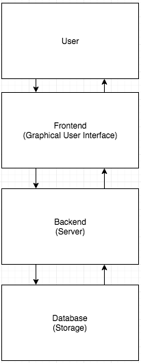

## 5.0	Requirements Specification

## 5.1	Introduction
This Software Requirements Specification (SRS) documents the requirements for the OrgSoft Human Resources Web Application (referred to as “OrgSoft” or “OrgSoft Web App” for the purposes of this document).

The OrgSoft Web App will be a cloud based application that will allow companies to register with the system to allow for their employees to track and record human resources related information. The system will comprise of a common employee section, which will allow each employee to maintain data such as hours worked specific to them, as well as an HR admin section, which will feature more extensive data access such as employment status. The OrgSoft system architecture shall be comprised of a client-side, browser-based interface (frontend), a cloud-hosted server (backend), and a relational database that will for storing and querying data. The frontend will consist of various web-pages that will allow users to easily input, request, and query information stored in the database. The server backend and database will be configured to optimize concurrent access as well as comply with HIPAA security rules to protect confidential client information.

	

## Outline of Requirements Specifications
- 5.2	CSCI Component Breakdown
- 5.3	Functional Requirements by CSC
- 5.4	Performance Requirements by CSC
- 5.5	Project Environment Requirements
	- 5.5.1	Development Environment Requirements
	- 5.5.2	Execution Environment Requirements

	
### 5.2 	CSCI Component Breakdown
- 5.2.1		OrgSoft Frontend CSC -- GUI components that the user will interact with
	- 5.2.1.1		Register Company CSU -- modules for registering company in system
		- 5.2.1.1.1	Register input module -- input fields for company, username, password
		- 5.2.1.1.2	Register button module -- button to submit inputs to server
	- 5.2.1.2		Register Employee CSU -- modules for registering new employee
		- 5.2.1.2.1	Register input module -- input fields for company, username, password
		- 5.2.1.2.2	Register button module -- button to submit inputs to server
	- 5.2.1.3		Login CSU -- modules for employee login
		- 5.2.1.3.1	Login input module -- input fields for user credentials
		- 5.2.1.3.2	Login button module -- button to submit inputs to server
	- 5.2.1.4		Employee Timecard CSU -- modules for employees to track timecard
		- 5.2.1.4.1 Clock In/Out module -- buttons for clocking in / out of work / for lunch
		- 5.2.1.4.2 Past Timecards module -- links to view previous timecards
	- 5.2.1.5		Supervisor Timecards CSU -- modules for supervisors to track subordinates timecards
		- 5.2.1.5.1 View Subordinates module -- table with links to view history of subordinate timecards
		- 5.2.1.5.2 Supervisor Edit module -- buttons for subordinate timecard editing acces
	- 5.2.1.6		Admin Timecards CSU -- modules for HR admins to track all timecards
		- 5.2.1.6.1 View Employees module -- table with links to view history of company employee timecards
		- 5.2.1.6.2 Timecard Edit module -- buttons for timecard editing access
	- 5.2.1.7		Employee Review CSU -- modules for supervisors and HR admins to track employee reviews
		- 5.2.1.7.1 Dashboard Table module -- table with summary of review data with link to further details
		- 5.2.1.7.2 Review History module -- table with performance review history
		- 5.2.1.7.2 Add Review module -- inputs for creating new review record
		- 5.2.1.7.3 Edit Review module -- inputs for editing existing review records
		- 5.2.1.7.4 Delete Review module -- button for deleting existing review records
	- 5.2.1.8		Employee Information CSU -- modules for HR admins to track employee info
		- 5.2.1.8.1 Edit Information module -- inputs for editing existing employee information
		- 5.2.1.8.1 Delete Employee module -- button for deleting existing employees

- 5.2.2		Server CSC -- server components that will host the Frontend
	- 5.2.2.1		NodeJS CSU -- modules for serving up Frontend files
	- 5.2.2.2		HTTPS CSU -- modules for network requests
	- 5.2.2.3		API Routes CSU

- 5.2.3		Database CSC -- database components that will store the data
	- 5.2.3.1		Tables CSU -- modules that will store the data in a relational model
	- 5.2.3.2		Stored Procedures CSU -- modules that will execute commonly needed queries on stored data

### 5.3	Functional Requirements

The OrgSoft Web App will allow users to input human resources information that will be stored in the system’s cloud database. In the requirements that follow, “user” is understood to be employees (HR admins, supervisors, and common employees). Users will have the ability retrieve and query this same information on demand.

- 5.3.1	Frontend
	- 5.3.1.1		The Frontend shall display an initial company registration page
	- 5.3.1.2		The Frontend shall display an initial employee registration page
	- 5.3.1.3		The Frontend shall display an initial employee login page
	- 5.3.1.4		The Frontend shall provide instructions for how to use the login page
	- 5.3.1.5		The Frontend shall provide text entry fields into which the user may type values
	- 5.3.1.6		The Frontend shall provide error checking on the text entry fields such that the user is provided immediate feedback in case of erroneous entry
	- 5.3.1.7		The Frontend shall direct users with different levels of access to different main pages
	- 5.3.1.8		The Frontend shall include a navigation bar at the top of the page
	- 5.3.1.9		The Frontend shall have menus for navigating between pages and content
	- 5.3.1.10		The Frontend shall have search bars for searching through large tables of information
	- 5.3.1.11		The Frontend shall have tables displaying information in rows and columns
	- 5.3.1.12		The Frontend shall react to mouse clicks on displayed buttons
	- 5.3.1.13		The Frontend shall display real-time data
	- 5.3.1.14		The Frontend shall require users to manually input personal information via text fields
	- 5.3.1.15		The Frontend shall have a Timecard page
		- 5.3.1.15.1	The Timecard page shall have buttons for clocking in and out
		- 5.3.1.15.2	The Timecard page shall have a table for viewing the current timecard's recorded times
		- 5.3.1.15.3	The Timecard page shall have a table for viewing previous timecards
		- 5.3.1.15.4	The Timecard page shall have buttons for editing the current timecard's recorded times
	- 5.3.1.16		The Frontend shall have an Employee Review page
		- 5.3.1.16.1	The Employee Review page shall have a table for viewing employee review records
		- 5.3.1.16.2	The Employee Review page shall link to pages for creating, editing, and deleting review records
		- 5.3.1.16.3	The Employee Review page shall link to a table for viewing previous review records
	- 5.3.1.17		The Frontend shall have an Employee Information page
		- 5.3.1.17.1	The Frontend shall have inputs for editing employee information
		- 5.3.1.17.2	The Frontend shall have buttons for editing and deleting employee information

- 5.3.2	Backend
	- 5.3.2.1		The Backend shall respond to HTTP requests from the client
	- 5.3.2.2		The Backend shall forward the results of queries from the Database to the Frontend
	- 5.3.2.3		The Backend shall support concurrent access of the database from multiple users
	- 5.3.2.4		The Backend shall timeout the network connection to the database after prolonged idling of 3 minutes at the least
	- 5.3.2.5		The Backend shall send error messages with details about connection issues
	- 5.3.2.6		The Backend shall close network channels that are not in use
	- 5.3.2.7		The Backend shall determine a network channel to not be in use when that channel has not made a request in the previous 3 minutes or longer
	- 5.3.2.8		The Backend shall maintain a network log
	- 5.3.2.9 		The Backend network log shall track successful HTTP requests
	- 5.3.2.10		The Backend network log shall track failed HTTP requests
	- 5.3.2.11		The Backend network log shall track server load
	- 5.3.2.12		The Backend network log shall track request speed
	- 5.3.2.13		The Backend network log shall track requests per second
	- 5.3.2.14		The Backend shall send periodic reports on network performance every second at the least
	- 5.3.2.15		The Backend shall respond with a 404 error code when a page or route is not found
	- 5.3.2.16		The Backend shall respond with a 500 error code when there is an error in the client-side server
	- 5.3.2.17		The Backend shall respond with a 200 error code when an HTTP request is successfully made and returned
	- 5.3.2.18		The Backend shall respond with a 401 error code when an HTTP request is unauthorized to the user

- 5.3.3	Database
	- 5.3.3.1		The Database shall perform queries on stored data
	- 5.3.3.2		The Database shall prevent errors from concurrent data modification
	- 5.3.3.3		The Database shall perform basic statistical analysis on queried data
	- 5.3.3.4		The Database shall generate aggregate data that can be used for reports
	- 5.3.3.5		The Database shall have procedures for backing-up stored data
	- 5.3.3.6		The Database shall be accessible only through an API
	- 5.3.3.7		The Database shall be HIPAA compliant
	- 5.3.3.8		The Database shall be hosted by a HIPAA compliant cloud service
	- 5.3.3.9		The Database shall maintain activity tracking logs according to HIPAA compliance
	- 5.3.3.10		The Database shall contain a table containing employee account login
	- 5.3.3.11		The Database shall contain a table containing a list of registered companies
	- 5.3.3.12		The Database shall contain a table containing employee information
	- 5.3.3.13		The Database shall contain a table containing employee review information
	- 5.3.3.14		The Database shall contain a table containing timecard data

- 5.3.4	System-wide
	- 5.3.4.1		The system shall provide a means for retrieving lost password information
	- 5.3.4.2		The system shall provide a means for resetting user passwords
	- 5.3.4.3		The system shall provide a means for troubleshooting connection errors
	- 5.3.4.4		The system shall provide a means for creating a new company record
	- 5.3.4.5		The system shall provide a means for creating a new employee account
	- 5.3.4.6		The system shall provide a means for creating a new employee review
	- 5.3.4.7		The system shall provide a means for creating a new timecard record
	- 5.3.4.8		The system shall provide a means for editing an existing company record
	- 5.3.4.9		The system shall provide a means for editing an existing employee account
	- 5.3.4.10		The system shall provide a means for editing an existing employee review
	- 5.3.4.11		The system shall provide a means for editing an existing timecard record
	- 5.3.4.12		The system shall provide a means for deleting an existing company record
	- 5.3.4.13		The system shall provide a means for deleting an existing employee account
	- 5.3.4.14		The system shall provide a means for deleting an existing employee review
	- 5.3.4.15		The system shall provide a means for deleting an existing timecard record
	- 5.3.4.16		The system shall incorporate different levels of user access for the database
	- 5.3.4.17		The system shall provide a means for communicating its current functional status to users
	- 5.3.4.18		The system shall provide a means for exporting data
	- 5.3.4.19		The system shall provide a means for users to customize settings for the entire system (Frontend, Backend, Database)
	- 5.3.4.20		The system shall provide a means for storing document files
	- 5.3.4.21		The system shall provide a means for storing image files

### 5.4	Performance Requirements

- 5.4.1	Successful login occurs within 5 seconds:
Upon entering credentials, the user should not have to wait more than 5 seconds to be redirected to their main profile page upon successful verification of those credentials.

- 5.4.2	Nearly instantaneous navigation:
Users should not experience delays in navigating between pages.

- 5.4.3	Usability design principles for the Frontend:
The graphical user interface shall be human-friendly and intuitive.

	- 5.4.3.1	Feedback:
At all times, the interface shall communicate the results of any interaction, making those results visible and understandable.

- 5.4.4	Search results within 5 second:
Users should see the first results of a search within 5 seconds of initiating the search.

- 5.4.5	Optimize storage:
The Database subsystem should be able to store the maximum amount of data with the minimum amount of storage space.

- 5.4.6 Bandwidth:
The Backend should optimize use of available bandwidth for data transmission.

- 5.4.7	Network connection cutoff:
The system should have default procedures for handling incomplete transactions during a network crash.

- 5.4.8	Modular programming:
The system design should incorporate separating functionality into independent, interchangeable modules, such that each contains everything necessary to execute only one aspect of the system’s overall functionality.

- 5.4.9 Data migration:
The data stored in the Database will be able to easily migrate to other database software in the future.

- 5.4.10 Emergency backup:
The Database should immediately backup data if network or server issues are detected.

### 5.5	Project Environment Requirements 

Utilizing pre-built frameworks such as Node.js will expedite development and provide more secure and stable server-side hosting.

#### 5.5.1	Development Environment Requirements

| Category | Requirement |
|---|---|
| Front End | Bootstrap, ComboDate, jQuery, Notify, Moment, Spectrum  | 
| Server | Node.js, npm, Hapi, Joi, npm-pg, Chai, CodeCov, ESLint, Istanbul, Mocha, Mocha-Istanbul, Nodemon |
| Database | PostgrSQL |

#### 5.5.2	Execution Environment Requirements

| Category | Requirement |
|---|---|
| Frontend | I/O server-side environment and API |
| Server | Heroku server hosting |
| Database | Heroku database hosting |

Due to the services that the OrgSoft Web App will provide, all software for this system should follow HIPAA security protocols. Furthermore, the need to reduce the risk for data loss as well as the need for ubiquitous access to the OrgSoft Web App from any platform requires a third-party cloud hosting service that specializes in secure data storage and maintenance.